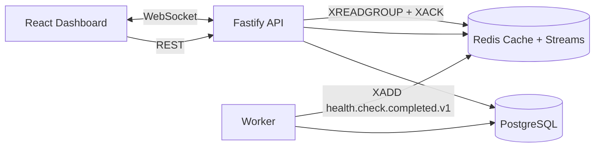

# NetPulse - Distributed Real-Time Service Health & Incident Monitoring

NetPulse is a production-style portfolio MVP that demonstrates event-driven monitoring architecture with Node.js, Fastify, PostgreSQL, Redis Streams, WebSockets, and a React dashboard.

## What this project demonstrates
- Distributed health checks via a dedicated worker process.
- Event-driven ingestion with Redis Streams and consumer groups.
- Incident lifecycle automation (open on 3 consecutive failures, resolve on recovery).
- Real-time updates to a UI using WebSockets.
- Caching strategy for low-latency dashboard reads.
- Reliability patterns: retries, simple circuit breaker, idempotent processing, rate limiting.

## Architecture Diagram

## Folder Structure

- `backend`: Fastify API + stream consumer + incident engine.
- `worker`: health-check poller + stream publisher.
- `frontend`: React dashboard + Recharts.
- `docs`: architecture and API documentation.
- `docker-compose.yml`: full local stack orchestration.

## Core Design Decisions
- Fastify for high throughput + plugin model + TypeScript friendliness.
- PostgreSQL for durable relational data and incident consistency.
- Redis for low-latency status cache and stream transport.
- Redis Streams for decoupled ingestion and horizontal consumer scaling.

See `docs/architecture.md` for detailed trade-offs.

## Data Model

- `Service`: monitored endpoint config.
- `Metric`: each health-check measurement.
- `Incident`: open/resolved incident state.

Prisma schema: `backend/prisma/schema.prisma`.

## Stream Design

- Stream key: `stream:health_checks`
- Event type: `health.check.completed.v1`
- Consumer group: `metrics-processors`
- Idempotency key: `eventId` (stored uniquely in `Metric.streamEventId`)

## Local Setup

1. Copy `.env.example` values into your local environment if needed.
2. Start stack:
   - `docker compose up --build`
3. Access:
   - API: `http://localhost:8080`
   - Frontend: `http://localhost:5173`
4. (Optional) local non-docker dev:
   - run `npm install` in `backend`, `worker`, `frontend`
   - backend: `npm run prisma:generate` then `npm run dev`
   - worker: `npm run dev`
   - frontend: `npm run dev`

## API Overview

Main endpoints:
- `POST /api/services` (with optional `tags`)
- `GET /api/services?tags=auth,payments`
- `PUT /api/services/:id`
- `DELETE /api/services/:id`
- `GET /api/dashboard/summary` (uptime per service)
- `GET /api/dashboard/metrics` (totals, healthy count, avg latency)
- `GET /api/services/:id/metrics/history?range=1h|24h|7d`
- `GET /api/timeline` / `GET /api/services/:id/timeline`
- `GET /api/alerts/channels` / `POST /api/alerts/channels`
- `GET /api/incidents`
- `GET /healthz` / `GET /readyz`

Detailed contracts: `docs/api.md`. Feature design: `docs/features.md`. Multi-region: `docs/multi-region.md`.

## Reliability/Scalability Notes

- Retry logic for transient health-check failures.
- Simple circuit breaker in worker for repeated failures.
- Cache TTL strategy via `STATUS_CACHE_TTL_SEC`.
- At-least-once processing with idempotent DB writes.
- Stream consumer group allows scaling API consumers horizontally.

## Production Features (Portfolio Extensions)

| Feature | Summary |
|---------|---------|
| Uptime tracking | Incremental counters, no full recompute |
| Historical metrics | 1h / 24h / 7d aggregated latency APIs + charts |
| Alerting | Discord + generic webhooks, deduplicated deliveries |
| Service tags | GIN-indexed filtering on dashboard |
| Dashboard metrics | Totals, health, incidents, avg latency, status breakdown |
| Incident timeline | Full event history API + UI |
| Multi-region | Bangalore, Singapore, Frankfurt workers (local Docker sim) |

## Scope limits

- No authentication.
- No Kubernetes/cloud deployment (multi-region is simulated via Docker workers).
