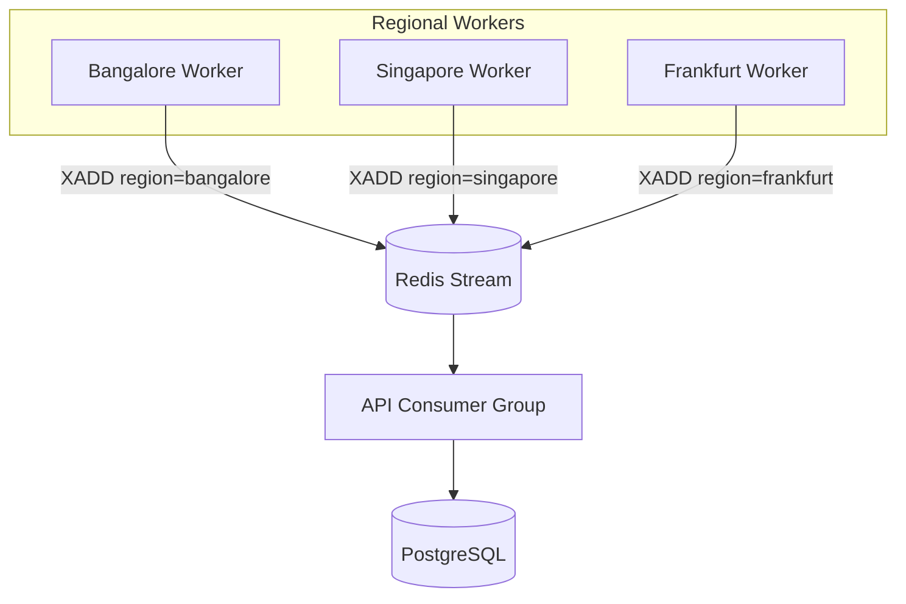

# Multi-Region Monitoring Architecture

## Overview

NetPulse simulates global monitoring by running **horizontally scaled worker processes**, each tagged with a `WORKER_REGION`. Worker logic is unchanged — only an env var and stream field were added.



## Why this scales

| Concern | Approach |
|---------|----------|
| Worker scale-out | N workers, same image, different `WORKER_REGION` |
| Ingestion scale-out | Redis consumer group `metrics-processors` — add API replicas with unique `STREAM_CONSUMER` |
| Storage | `Metric.region` + composite index for per-region history |
| No worker rewrite | Existing probe/retry/circuit-breaker loop preserved |

## Local simulation

```bash
docker compose up --build
```

Three workers check all active services and publish region-tagged events. The dashboard latency chart can filter by region when multiple exist.

## Production path (not implemented)

- Deploy workers in each geography (K8s DaemonSet / regional ECS tasks)
- Optional: partition services by region assignment
- Consumer group on API tier behind load balancer
